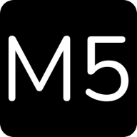

# M3ns4agem S3cret4 (Cifra de César/ Cipher)

## Índice

* [1. Prefácio](#1-prefácio)
* [2. Sobre o produto](#2-sobre-o-produto)
* [3. Como usar](#3-como-usar)
* [4. Protótipo do projeto](#4-protótipo-do-projeto)
* [4-1. Primeiro feito no papel](#4-1-primeiro-feito-no-papel)
* [4-2. Segundo também no papel](#4-2-segundo-também-no-papel)
* [5. Tecnologias utilizadas](#5-tecnologias-utilizadas)
* [6. Resultado](#6-resultado)
* [7. Sobre a autora](#7-sobre-a-autora)

---

## 1. Prefácio 

Cifrar significa codificar. A [cifra de César](https://pt.wikipedia.org/wiki/Cifra_de_C%C3%A9sar)
é um dos primeiros tipos de criptografias conhecidas na história.
O imperador romano Júlio César utilizava essa cifra para enviar
ordens secretas aos seus generais no campo de batalha.

A cifra de César é uma das técnicas mais simples de cifrar uma mensagem. É um
tipo de cifra por substituição, em que cada letra do texto original é
substituida por outra que se encontra há um número fixo de posições
(deslocamento) mais a frente do mesmo alfabeto.

Por exemplo se usarmos o deslocamento (_offset_) de 3 posições:

- Alfabeto sem cifrar: A B C D E F G H I J K L M N O P Q R S T U V W X Y Z
- Alfabeto com cifra: D E F G H I J K L M N O P Q R S T U V W X Y Z A B C
- A letra A será D
- A palavra CASA será FDVD

Atualmente todas as cifras de substituição alfabética simples, são decifradas
com facilidade e não oferecem muita segurança na comunicação por si mesma,
mas a cifra de César muitas vezes pode fazer parte de um sistema
mais complexo de criptografia, como
a cifra de Vigenère, e tem aplicação no sistema ROT13.

## 2. Sobre o produto

Mensagem secreta é uma aplicação que permite o envio de mensagem para um amigo, familiar ou até namorado(a) utilizando qualquer mensageiro eletrônico (como Whatsapp, Facebook ou e-mail). As vezes precisamos enviar informações importantes ou até conversar sobre assuntos um pouco polêmicos e que não queremos que caia nas mãos (ou olhos) errados.
Mensagem Secreta está aqui para garantir que sua mensagem será decifrada pela pessoa certa. 

O usuário poderá cifrar e decifrar um texto indicando a chave de deslocamento (offset).

## 3. Como usar 

Para usar o M3ns4agem S3cret4, basta digitar sua mensagem, frase ou palavra no campo de "Texto", selecionar o número de deslocamento (de 1 a 25), para criptografar basta clicar no botão "Cifrar" e você verá a mensagem cifrada no campo "Resultado", para descriptografar basta colar a mensagem recebida no campo "Texto" e informar o deslocamento (deve ser o mesmo utilizado na hora de Cifrar) e clicar no botão "Decifrar" e o resultado será mostrado no campo "Resultado".

## 4. Protótipo do projeto

A interface deve permitir ao usuário:

- Eleger um *offset* indicando quantas posições de deslocamento de caracteres quer que a cifra utilize.
- Inserir uma mensagem (texto) para ser cifrada.
- Ver o resultado da mensagem cifrada.
- Inserir uma mensagem (texto) para ser decifrada.
- Ver o resultado da mensagem decifrada.

 

---

 

## 4-1. Primeiro feito no papel

 

Depois de definir o tema e começar a pensar na cor comecei o desenho do prototipo que continha:

- Adicionar o logo e o nome do projeto
- Uma breve explicação de como funciona/ como usar
- Ideia seria separar por uma linha (vertical ou horizontal)
- 2 caixas para o usuário inserir texto (para cifrar e decifrar)
- 2 offset/ deslocamento (cifra e decifra)
- 2 caixas com resultado (cifrado e decifrado)

 

---

 

## 4-2. Segundo também no papel

 

 

Depois de iniciar a pesquisa do UX e JS, percebi que o prototipo anterior não estava tão viavel e não estava tão acessivel para o usuário. Pensando nisso ele foi alterado para algo mais simples e dinâmico.

- Adicionar o logo e o nome do projeto
- Uma breve explicação de como funciona/ como usar
- 1 caixas para o usuário inserir texto (para cifrar e decifrar)
- 1 offset/ deslocamento (cifra e decifra)
- 2 botões (para cifrar e decifrar)
- 1 caixa com resultado (cifrado e decifrado)
- Footer/ Rodapé

## 5. Tecnologias utilizadas
 

- 

-  

-  

-  

## 6. Resultado 
Projeto desenvolvido utilizando a metodologia ágil <a href="https://fia.com.br/blog/scrum/#:~:text=A%20metodologia%20Scrum%20foi%20proposta,processos%20de%20gest%C3%A3o%20de%20projetos.">Scrum</a>, em 4 sprints.

[Teste aqui](#)

## 7. Sobre a autora

Olá! Me chamo Julia Benedicto e sou aluna do bootcamp da Laborátoria, focado em desenvolvimento Front-end e este foi o primeiro projeto.

Saiba mais:

- 

- 

- 

